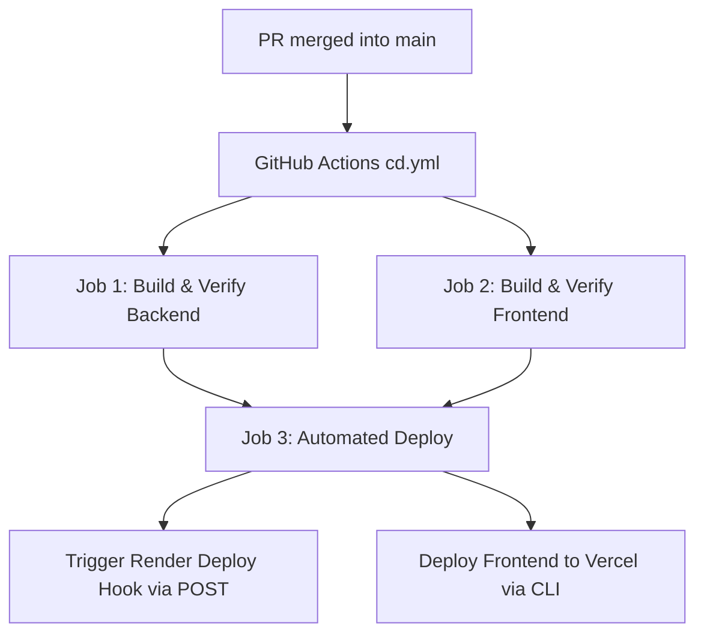

# Continuous Deployment (CD) Setup Guide

This document outlines the Continuous Deployment (CD) workflow for **GACS (Grid-Aware Compute Scheduler)** satisfying **GRID-117 AC3.1**:
> **AC3.1** — On every merge to main, the CD workflow automatically builds and deploys the latest version of the application with no manual steps.

---

## 1. Overview Architecture

Whenever a pull request is merged into `main` (enforced via `enforce-staging-source.yml`), GitHub Actions initiates `.github/workflows/cd.yml`:

1. **Backend Verification**: Compiles with Java 25 & Maven (`./mvnw clean package`) and runs automated tests with H2 database.
2. **Frontend Verification**: Installs dependencies and runs `npm run build` to verify Next.js bundle and TypeScript compilation.
3. **Automated Deployment**: Triggers Render (Spring Boot) and Vercel (Next.js) with **no manual approval gates**.

---

## 2. Render Setup (Backend Web Service)

1. Log into [Render](https://render.com) and click **New + $\rightarrow$ Web Service**.
2. Connect repository: `mingda19/CS203-Grid-Aware-Compute-Scheduler`.
3. Configure Service Settings:
   * **Name**: `gacs-backend`
   * **Root Directory**: `backend`
   * **Language / Runtime**: `Docker`
   * **Dockerfile Path**: `./Dockerfile` (or `Dockerfile`)
   * **Region**: Choose closest (e.g., Oregon or Singapore)
   * **Instance Type**: Free / Starter
4. **Environment Variables** (Under the *Environment* tab):
   * `DATABASE_URL`: Your PostgreSQL connection string (e.g. from Render PostgreSQL)
   * `JWT_SECRET_KEY`: Long 256-bit base64 secret string
   * `JWT_ACCESS_EXPIRATION_MS`: `900000`
   * `JWT_REFRESH_EXPIRATION_MS`: `86400000`
   * `JWT_REMEMBER_ME_EXPIRATION_MS`: `1209600000`
   * `COOKIE_SECURE`: `true` (in production HTTPS)
   * `CORS_ALLOWED_ORIGINS`: Your Vercel frontend URL (e.g. `https://gacs-frontend.vercel.app`)
5. **Get Deploy Hook URL**:
   * In Service **Settings** $\rightarrow$ scroll to **Deploy Hook**.
   * Click **Add Deploy Hook** $\rightarrow$ copy the generated URL:
     `https://api.render.com/deploy/srv-xxxxxxxxxxxx?key=yyyyyyyyyy`

---

## 3. Vercel Setup (Frontend)

1. Log into [Vercel](https://vercel.com) and click **Add New... $\rightarrow$ Project**.
2. Select `mingda19/CS203-Grid-Aware-Compute-Scheduler`.
3. Configure Project Settings:
   * **Framework Preset**: `Next.js`
   * **Root Directory**: `frontend`
4. Set Environment Variables:
   * `NEXT_PUBLIC_API_URL`: Your Render backend URL (e.g. `https://gacs-backend.onrender.com`)
5. Click **Deploy**.
6. **Obtain Vercel Token and IDs**:
   * `VERCEL_TOKEN`: Vercel Account $\rightarrow$ Settings $\rightarrow$ Tokens $\rightarrow$ Create Token.
   * `VERCEL_PROJECT_ID`: Vercel Project $\rightarrow$ Settings $\rightarrow$ General $\rightarrow$ Project ID.
   * `VERCEL_ORG_ID`: Vercel Account / Team Settings $\rightarrow$ General $\rightarrow$ Team ID / User ID.

---

## 4. GitHub Actions Repository Secrets

Under **GitHub Repository $\rightarrow$ Settings $\rightarrow$ Secrets and variables $\rightarrow$ Actions**, add:

| Secret Name | Description | Source |
| :--- | :--- | :--- |
| `RENDER_DEPLOY_HOOK_URL` | Render Deploy Hook URL | Render Web Service $\rightarrow$ Settings $\rightarrow$ Deploy Hook |
| `VERCEL_TOKEN` | Vercel personal access token | Vercel Account Settings $\rightarrow$ Tokens |
| `VERCEL_ORG_ID` | Vercel Account/Team ID | Vercel Project / Team Settings |
| `VERCEL_PROJECT_ID` | Vercel Project ID | Vercel Project $\rightarrow$ Settings $\rightarrow$ General |
