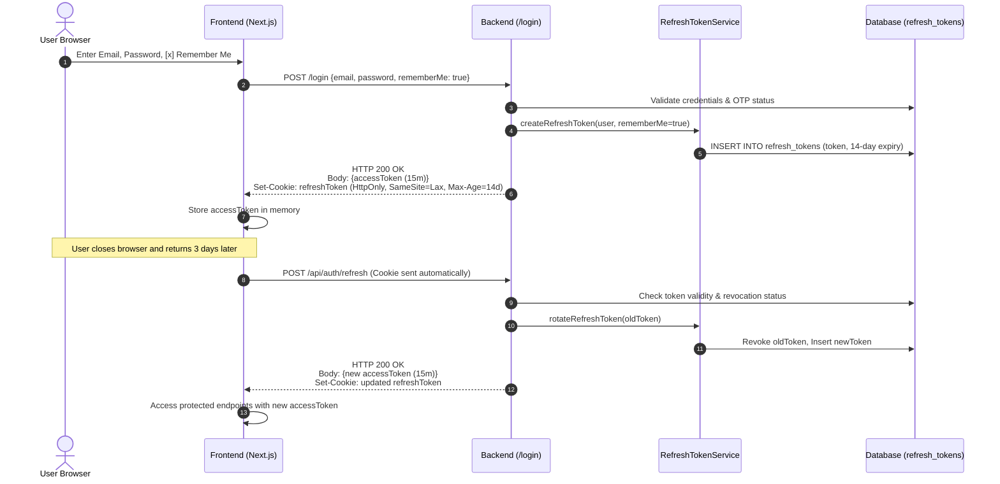

# Token Expiry and Secure Storage Policy
**Grid Aware Compute Scheduler (GACS)**  
**Document Status:** Approved Baseline  
**Classification:** Security Architecture Standard  
**Sprint Deliverable:** Security & Authentication Architecture  

---

## 1. Executive Summary & Purpose

The **Grid Aware Compute Scheduler (GACS)** platform orchestrates sensitive, high-cost computing workloads (e.g., HPC clusters, ML training, crypto-mining) across electricity grid cycles. Protecting the platform against unauthorized access, credential theft, session hijacking, Cross-Site Scripting (XSS), and Cross-Site Request Forgery (CSRF) is essential.

This policy defines:
1. **Token Lifecycles & Expiry Rules**: Precise time-to-live (TTL) limits for Access Tokens, Persistent Refresh Tokens (Remember-Me), and One-Time Passwords (OTP).
2. **Client-Side Secure Storage Standards**: Architectural enforcement of browser storage mechanisms, prohibiting insecure client storage (`localStorage` / `sessionStorage`) for sensitive credentials and mandating `HttpOnly`, `SameSite=Lax`, and `Secure` cookies.
3. **Server-Side Persistence & Invalidation**: Database schema, token family rotation, theft detection, and instant revocation mechanisms.
4. **Remember-Me Persistence Architecture**: Safe sliding-window session persistence across browser sessions without compromising credential security.

---

## 2. Token Classification & Expiry Matrix

The GACS authentication architecture utilizes three distinct token types, each designed for a specific trust boundary and lifetime.

| Token Type | Technology / Format | Scope / Role | Default Expiration (TTL) | Renewal / Rotation Policy | Storage Location |
|---|---|---|---|---|---|
| **Access Token** | Signed JWT (HMAC-SHA256) | Stateless authorization bearer token for REST API endpoints | **15 minutes** (900 seconds) | Non-renewable; must be refreshed using a valid Refresh Token | Client memory (React state) / Authorization Bearer header |
| **Standard Refresh Token** | Cryptographically Secure Random String (UUIDv4) | Exchange for new Access Tokens when "Remember Me" is **not** checked | **24 hours** (86,400 seconds) | Single-use; rotated on every `/api/auth/refresh` request | Browser `HttpOnly` cookie (`refreshToken`), Server Database |
| **Remember-Me Refresh Token** | Cryptographically Secure Random String (UUIDv4) | Exchange for new Access Tokens when "Remember Me" **is** checked | **14 days** (1,209,600 seconds) | Single-use; rotated on every `/api/auth/refresh` request | Browser `HttpOnly` cookie (`refreshToken`), Server Database |
| **OTP Verification Code** | 6-digit numeric string | Proves email ownership during registration and unverified login attempts | **10 minutes** (600 seconds) | Invalidated immediately upon first use or superseded by fresh request | Server Database (`otp_verifications` table) |

---

## 3. Detailed Token Lifecycle Specifications

### 3.1 JWT Access Tokens
* **Algorithm**: HMAC-SHA256 (`HmacSHA256`) using a cryptographically secure 256-bit+ secret key configured via environment variables (`JWT_SECRET_KEY`).
* **Payload Claims**:
  * `sub`: Subject (User's unique email address).
  * `userId`: Database primary key identifier.
  * `role`: User authority (e.g., `ROLE_USER`, `ROLE_ADMIN`).
  * `iat`: Issued-at timestamp (UTC epoch seconds).
  * `exp`: Expiration timestamp (UTC epoch seconds, exactly 15 minutes after issuance).
* **Stateless Validation**: The backend validates the cryptographic signature and expiration on every protected request without requiring a database query, ensuring sub-millisecond response latency.
* **Short Lifespan Rationale**: 15 minutes strictly bounds the window of vulnerability in the unlikely event an access token is intercepted in transit.

### 3.2 Refresh Tokens & Remember-Me Session Persistence
* **Generation**: Generated using a cryptographically strong pseudo-random number generator (`SecureRandom` / UUIDv4), yielding 128 bits of entropy.
* **Persistent Session ("Remember Me") Policy**:
  * When `rememberMe: false`: The refresh token expires after **24 hours**.
  * When `rememberMe: true`: The refresh token persists for **14 days**.
  * **Sliding Expiration**: When the user actively interacts with the application, token rotation refreshes the active session window.
* **Token Family Tracking & Rotation (RTR - Refresh Token Rotation)**:
  * Every refresh request (`POST /api/auth/refresh`) invalidates the submitted token and issues a **new** refresh token and access token.
  * The database retains an audit pointer (`replaced_by_token`) connecting the prior token to the newly issued one.
* **Automatic Theft Detection & Invalidation**:
  * If a revoked or previously used refresh token is submitted to `/api/auth/refresh`, the server detects that the token was potentially stolen and replayed by an adversary.
  * **System Response**: The backend immediately invalidates and revokes **all** refresh tokens belonging to that user's session family, effectively logging out both the legitimate user and the attacker, and logs a critical security audit event.

### 3.3 One-Time Password (OTP) Tokens
* **Format**: 6-digit cryptographically pseudo-random numeric code (`100000`–`999999`).
* **Validity Period**: Strictly **10 minutes**.
* **Usage Invalidation**: Marked `is_used = true` immediately upon successful verification.
* **Rate Limiting & Cooldown**: A 60-second cooldown period is enforced between resend requests. Generating a new OTP immediately invalidates any prior unused OTPs for that email address.

---

## 4. Client-Side Secure Storage Policy

Browser-based storage mechanisms differ significantly in their security boundaries against Cross-Site Scripting (XSS).

### 4.1 Strict Prohibition of LocalStorage / SessionStorage for Sensitive Credentials
> [!CAUTION]
> **Policy Directive**: **NO** authentication tokens (JWT Access Tokens or Refresh Tokens), passwords, or OTP secrets may be stored in browser `localStorage` or `sessionStorage`.
> 
> *Rationale*: Any third-party script, malicious NPM dependency, or XSS flaw has unrestricted synchronous read access to `localStorage`, allowing trivial exfiltration of long-lived credentials.

### 4.2 Cookie Security Standards for Refresh Tokens
Refresh tokens are stored in browser cookies under the strict enforcement of the following security attributes:

| Cookie Attribute | Enforced Value | Security Rationale |
|---|---|---|
| `HttpOnly` | **`true`** | Completely blocks access from client-side JavaScript (`document.cookie`), neutralizing token exfiltration via XSS. |
| `Secure` | **`true`** (Production) / `false` (Localhost Dev) | Mandates that the cookie is transmitted only over encrypted TLS/HTTPS connections, preventing eavesdropping on public Wi-Fi. |
| `SameSite` | **`Lax`** | Prevents the cookie from being sent on unauthorized cross-site requests, providing robust protection against Cross-Site Request Forgery (CSRF). |
| `Path` | **`/`** (or `/api/auth`) | Scopes the cookie transmission strictly to the backend application endpoints. |
| `Max-Age` | **1,209,600s** (Remember-Me) / **86,400s** (Standard) | Enforces persistent storage on the client browser matching the server-side TTL. |

### 4.3 Permitted Client Storage
* **Non-Sensitive UI Cache**: Client `localStorage` is strictly restricted to non-sensitive user profile metadata (e.g., `fullName`, `email`, `role`) solely used to prevent UI flickering during initial rendering.
* **Access Token**: Stored in client memory (React application state). Upon page reload or tab reopening, the client transparently fetches a new Access Token by calling `/api/auth/refresh` using the persistent `HttpOnly` cookie.

---

## 5. Server-Side Persistence & Invalidation Policy

### 5.1 Database Storage Schema (`refresh_tokens`)
The persistent session state is managed in the backend relational database (`PostgreSQL` / `H2` for tests) with the following schema:

```sql
CREATE TABLE refresh_tokens (
    id BIGSERIAL PRIMARY KEY,
    token VARCHAR(255) NOT NULL UNIQUE,
    user_id BIGINT NOT NULL REFERENCES users(id) ON DELETE CASCADE,
    expiry_date TIMESTAMP WITH TIME ZONE NOT NULL,
    revoked BOOLEAN NOT NULL DEFAULT FALSE,
    remember_me BOOLEAN NOT NULL DEFAULT FALSE,
    created_at TIMESTAMP WITH TIME ZONE NOT NULL DEFAULT CURRENT_TIMESTAMP,
    replaced_by_token VARCHAR(255),
    client_ip VARCHAR(45),
    user_agent VARCHAR(255)
);

CREATE INDEX idx_refresh_token ON refresh_tokens(token);
CREATE INDEX idx_refresh_token_user ON refresh_tokens(user_id);
```

### 5.2 Token Revocation Triggers
Active tokens and persistent sessions are terminated under the following conditions:

1. **User Logout (`POST /api/auth/logout`)**:
   * The backend marks the corresponding refresh token as `revoked = true` in the database.
   * The response sends an expired cookie (`Max-Age=0`) to instruct the browser to discard the cookie immediately.
2. **Password Change / Credential Reset**:
   * All existing refresh tokens for the user account are immediately marked `revoked = true`, forcing all connected devices to re-authenticate.
3. **User Deactivation / Role Demotion**:
   * Administrative suspension or demotion immediately revokes all associated refresh tokens.
4. **Theft / Replay Detection**:
   * If a revoked token is used, all tokens in the lineage are revoked immediately.
5. **Periodic Pruning**:
   * A scheduled cleanup task purges expired and revoked tokens older than 30 days to maintain database hygiene and performance.

---

## 6. End-to-End Authentication & Persistence Workflow



---
